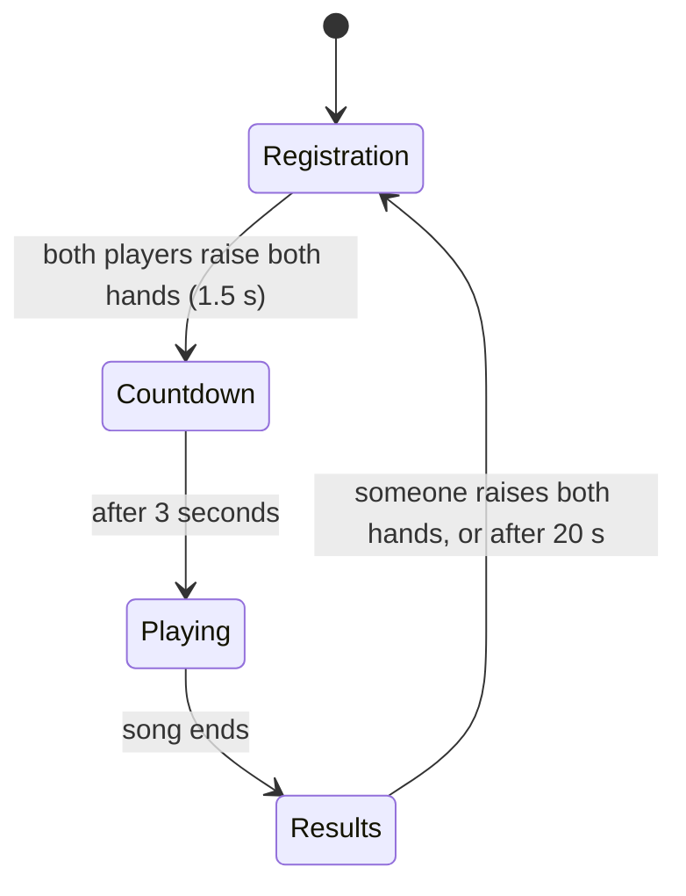

# Game structure plan

This plan explains how we turn the current `main.py` loop into a clear game with **game states**.
It is written for the whole team. Each step at the end can be picked up by one person.

## 1. Goals

- The game has clear **states**: Registration, Countdown, Playing, Results. There is no main menu: the game starts in Registration.
- Players control the game with **gestures only** (no keyboard, no mouse).
- The game is always for **2 players**.
- **One song with audio.** The poses follow the music.
- When a player is **lost** during the song, the game shows a warning. The song keeps playing.
- The score is **fair**: a faster computer does not give more points.
- **Clear files.** Every file has one clear job, and every state has its own file.

## 2. The states



| State | What the players see | What the game checks | How to leave |
|---|---|---|---|
| **Registration** | Camera image, "Player 1" / "Player 2" labels in their colour, a "ready" mark per player | Are 2 players found? Is each player holding hands up? | Both players ready → Countdown |
| **Countdown** | Big "3", "2", "1", "Dance!" and the NEXT card with the first move | Only time | After 3 s → Playing (music starts) |
| **Playing** | The NOW and NEXT move cards, score bar, a pose rating ("Perfect", "Good", ...) and a warning when a player is lost | Song clock, current move, grading, lost players | Song ends → Results |
| **Results** | Final scores, the winner (or "Draw") | Hands up, or time | Hands up 1.5 s, or 20 s → Registration (new players) |

### Rules for each state

**Registration**
- The game **starts** here, and comes back here after Results.
- When we enter this state, we call `tracker.reset()`. This removes old players and old scores.
- The tracker gives Player 1 and Player 2 to the first two people it sees.
- A player is **ready** after holding both hands up for 1.5 s. If the player leaves the image, "ready" is removed again.
- Extra help: when `tracker.colors_are_similar()` is True, show "Please wear different colours".

**Countdown**
- No grading yet. It gives players time to get into position.
- The NEXT card already shows the first move, so players can get ready.
- At the end of the countdown, the music starts.

**Playing**
- The **song clock** comes from the audio player, not from `time.time()`. Then the poses always stay in sync with the music.
- Each move has a start and an end. Between moves there can be a rest. See section 5.
- The NOW card shows the active move, the NEXT card the move after it.
- Grading: see section 6.
- **Lost player:** a registered player who is not visible for more than 0.5 s is "lost".
  - Show "Player 2 lost — step back in!" in the colour of that player.
  - The song continues. The lost player gets no points until found again.
  - We wait 0.5 s before showing the warning, so it does not flicker when the tracker misses one frame.

**Results**
- Show both scores and the winner.
- Wait at least 3 s before gestures work, so nobody skips the screen by accident.
- "Raise both hands to play again" → Registration. The next players register again.

### Gesture: "hands up"

There is one gesture for the whole game: **both wrists above the nose**.
To avoid accidental starts, the player must **hold** it for 1.5 s. Show a small progress bar while the player holds it.
The hold time is measured in **seconds**, not in frames. Then it works the same on every computer.

The **q** / **ESC** key still closes the window. This is only a safety exit, not a game control.

## 3. File structure

We add new code files (one per state) and remove 3 old ones. Folders that already work stay the same.

```
main.py                       # SMALLER: only starts the game (about 20 lines)
config.py                     # NEW: all settings in one place
camera.py                     # same
game_logic/
    game.py                   # NEW: Game class, runs the loop and switches states
    states/                   # NEW: one file per state
        common.py             #   State base class, "hands up" gesture, move cards helper
        registration.py       #   RegistrationState
        countdown.py          #   CountdownState
        playing.py            #   PlayingState (+ the rating)
        results.py            #   ResultsState
    song.py                   # NEW: reads the song file, audio, song clock, current + next move
    pose_grading.py           # same grading (for now), only the Pencil pose added
scene/                        # one file per part of the screen (docs/scene_changes.md)
    scene.py                  #   the original Scene class (title, score bar) + draw_ratings()
    functions.py              #   the original text helpers + colours and small building blocks
    pose_figure.py            #   NEW: a pose as a stick figure
    move_cards.py             #   NEW: the NOW / NEXT cards
    registration_screen.py    #   NEW: the Registration screen
    results_screen.py         #   NEW: the Results screen
choreography/
    poses.json                # the ONLY place where poses are defined
    song_1.json               # CHANGED: new format (section 5)
    song_1.wav                # NEW: the music (test music from branch test-structure)
identity_tracking/, pose_tracking/, face_tracking/   # same

REMOVED:
game_loop/game_loop.py        # replaced by game_logic/song.py
game_logic/track_manager.py   # not used, loads a file that does not exist
choreography/choreography.json  # old frame-by-frame recording, not used
```

### Who does what

| File | Job | Does NOT do |
|---|---|---|
| `main.py` | Read command line arguments, create `Game`, call `game.run()` | Any game logic |
| `config.py` | Numbers and paths: hold time, lost time, countdown time, file paths | Logic |
| `game.py` | Own the shared parts (camera, pose, tracker, grader, song, scene). Each frame: read camera → find players → update state → draw → show | Decide what happens in a state |
| `states/*.py` | Decide **what** happens in each state, and when to switch. One file per state; `common.py` has the parts that more states use. | Draw pixels itself |
| `song.py` | Load the song, play audio, give the song time, the current move and the next move | Grading |
| `pose_grading.py` | Give a score 0–100 for one pose (the existing `PoseGrader`, not changed for now) | Keep totals |
| `scene/*.py` | Decide **how** things look on screen. One file per part of the screen. | Game rules |

The main rule: **states decide, the scene draws.** Then we can change the look without breaking the game, and the other way around.

## 4. How the code fits together

This is a short sketch to show the idea. It is not the final code.

```python
# game_logic/states/common.py
class State:
    def enter(self, game):          # called once when we switch to this state
        pass

    def update(self, game):         # called every frame, returns the name of the next state or None
        return None

    def draw(self, game, image):    # called every frame, returns the image to show
        return image


# game_logic/states/countdown.py
class CountdownState(State):
    def enter(self, game):
        self.start = game.now

    def update(self, game):
        if game.now - self.start >= config.COUNTDOWN_TIME:
            return "playing"
        return None

    def draw(self, game, image):
        seconds_left = config.COUNTDOWN_TIME - (game.now - self.start)
        return draw_big_text(image, str(math.ceil(seconds_left)))     # from scene/functions.py
```

```python
# game_logic/game.py
class Game:
    def __init__(self, camera):
        self.camera = camera
        self.pose_estimator = PoseEstimator(...)
        self.tracker = IdentityTracker(max_players=2)
        self.pose_grader = PoseGrader()
        self.song = Song(config.SONG_PATH)
        self.scene = Scene()
        self.states = {
            "registration": RegistrationState(), "countdown": CountdownState(),
            "playing": PlayingState(), "results": ResultsState(),
        }
        self.players = {}
        self.now = 0.0
        self.change_state("registration")

    def change_state(self, name):
        self.state = self.states[name]
        self.state.enter(self)

    def run(self):
        while True:
            frame = self.camera.read()
            if frame is None:
                break
            self.now = frame.time
            keypoints, _ = self.pose_estimator.process(frame.image)
            self.players = self.tracker.update(frame.image, people_from_pose(keypoints))

            next_state = self.state.update(self)
            if next_state:
                self.change_state(next_state)

            image = self.state.draw(self, frame.image.copy())
            cv2.imshow("Just Dance", image)
            if cv2.waitKey(1) & 0xFF in (ord("q"), 27):
                break
```

## 5. Choreography

### What we have now

`song_1.json` puts a move name on a beat, and the poses are in `poses.json`. Problems: a move has no end, and the pose scale does not match the grader.

The frame-by-frame recording `choreography.json` (from branch `test-structure`) is **not used**. It is 1.5 MB, cannot be edited by hand, and its move names and left/right sides do not match `poses.json`. We remove it.

### New design

- **One format:** a small song file that uses **beats**, plus the pose library `poses.json`.
- **Static poses.** The screen shows the pose. It does not show a moving dancer.
- **The next pose is always visible**, also during the countdown. Players can get ready in time.
- **Gold moves** give double points.

### Song file: `song_1.json`

```json
{
    "title": "Song 1",
    "audio": "song_1.wav",
    "bpm": 120,
    "offset": 0.0,
    "moves": [
        { "beat": 4,  "pose": "cactus", "beats": 2 },
        { "beat": 8,  "pose": "t_pose", "beats": 2 },
        { "beat": 12, "pose": "pencil", "beats": 2, "gold": true }
    ]
}
```

| Field | Meaning |
|---|---|
| `audio` | Music file, in the same folder as the song file |
| `bpm` | Beats per minute of the music |
| `offset` | Seconds of music before beat 0 |
| `beat` | The beat where the player must **be in** the pose. The move becomes active here. |
| `pose` | Name of a pose in `poses.json` |
| `beats` | How long the player must hold the pose. Default: 2. |
| `gold` | Optional. `true` = double points. |

Beat to seconds: `seconds = offset + beat * 60 / bpm`.
Because we use beats, all moves stay on the music. If the music starts a bit late, we only change `offset`.

**Test music:** branch `test-structure` has `assets/song.wav`. A script made this file, so there is no copyright problem. It is 120 BPM and 64 s, the same as `song_1`. We can copy it to `choreography/song_1.wav` until we have a real song.

### Inside `song.py`

```python
@dataclass
class Move:
    name: str        # "cactus", shown on screen
    pose: dict       # {"nose": (x, y), ...}, from poses.json
    start: float     # seconds: the move becomes active
    end: float       # seconds: the move is over
    gold: bool


class Song:
    def start(self): ...                 # start the music
    def stop(self): ...
    def time(self): ...                  # song time in seconds, from the audio clock
    def current_move(self): ...          # the active Move, or None between moves
    def next_move(self): ...             # the next Move that is not active yet, or None
    def is_finished(self): ...
```

- Use `pygame.mixer.music` for the audio (add `pygame` to `requirements.txt`). It plays `.wav`, `.ogg` and `.mp3`. `get_pos()` tells us how far the music is.
  `sounddevice` is already installed, but it cannot open music files by itself.
- If the audio file is missing, `time()` uses a normal timer. Then we can still test without sound.
- The song is finished when the music stops. Without music: 2 s after the last move.
- **Check the file when loading**, not during the song. If a pose name is not in `poses.json`, or two moves overlap, stop with a clear message, like: `song_1.json move 7: pose "pencl" not found`.
  Then a typo never crashes the game in the middle of a song.

### On screen: the move cards

Two cards in a corner of the screen:

```
 +-----------------+   +-----------+
 |      NOW!       |   |   NEXT    |
 |                 |   |           |
 |     (pose)      |   |  (pose)   |
 |                 |   |           |
 | ███████░░░░░░░░ |   | ▓▓▓▓▓░░░░ |
 +-----------------+   +-----------+
   hold: bar gets       get ready: bar fills,
   empty                pulses on every beat
```

| Card | When | Looks |
|---|---|---|
| **NEXT** | Always, from the start of the Countdown | Smaller card. The bar fills up until the move starts. The card pulses a little on every beat, so players feel the rhythm. |
| **NOW** | While a move is active | Big card with a bright border and the text "NOW!". The bar gets empty while the player holds the pose. |
| **NOW** (between moves) | No active move | Dark card with "Get ready". |
| Gold move | NOW or NEXT card | Gold border and the label "GOLD". |

When a move starts, the NEXT card moves into the NOW place with a short flash. Then the player clearly sees: "this one counts now".

## 6. Fair scoring

**Now:** every frame adds a score. At 30 FPS a player gets twice as many points as at 15 FPS.

**Grading stays the same for now.** We keep `pose_grading.py` (the `PoseGrader` class) as it is. The game calls
`pose_grader.grade_pose(player["keypoints_raw"], move.key)`, where `move.key` is the pose name from the song file (`"cactus"`).

Because the grader is not changed:
- **Left and right are swapped before grading** (`MIRROR_SWAP` in `states/playing.py`). YOLO names left and right by how the body looks, so in our mirrored camera image the player's left arm is called `right_*`. The grader's poses have `left_*` on the left of the screen. Without the swap, even a perfect pose scored below 20 (always "Miss").
- The grader had only `cactus` and `t_pose`. We **added `pencil`** to its pose list (only new pose data, same style as the other two). If a song uses a pose that the grader does not know, those moves give no points, and the game prints a warning at start-up.
- **The grader's reference poses are measured on a real player** (only the numbers in `pose_grading.py` changed, not the grading code). Knees and ankles are `None`: our poses do not use the legs, and the webcam often cannot see them. Before, YOLO guessed the invisible legs at hip height, and those 4 points alone pulled every score down to about 27. The arm positions come from a webcam recording (made symmetric). Now the right pose scores about 89–92 ("Perfect") and a wrong pose 25–53. The grader still has its own pose list next to `poses.json` (section 7, item 3).
- Later idea: compare **limb angles** instead of positions. Angles do not change with body size or distance, so no scaling is needed. The branch `test-structure` does this in `gameplay/scorer.py`.

**New: points once per move.**

1. Players need some time to react. So we grade a move from `start` to `end + 0.3 s`.
2. During that time, grade every frame, but only remember the **best score** of each player.
3. When the time is over, add that best score to the total of the player. **Gold move: × 2.**
4. Show a rating for 1 s: **Perfect** (≥ 85), **Good** (≥ 65), **OK** (≥ 40), **Miss** (< 40).
5. A lost player keeps the best score from before getting lost. If the player was lost for the whole move, the score is 0.

The scene shows the total score as a whole number.

## 7. Cleanup of the current code

| # | Problem | Fix |
|---|---|---|
| 1 | In `main.py`, `draw_pose_comparison()` contains a copied part of `process_frame()`. It uses names that do not exist there (`frame`, `players`, `start_time`). | Remove this part. If we want debug drawings, add a `--debug` flag and draw keypoints / face outline in `scene.py`. |
| 2 | Grading always uses `"cactus"`, not the pose on screen. | Grade `move.key` of the current move. |
| 3 | Poses are defined twice: in `pose_grading.py` and in `poses.json`. The `pencil` pose is only in `poses.json`, so grading it would crash. | Pencil is added to the grader. **Later**: one pose list for the screen and the grader. |
| 4 | The two pose lists use a different scale (hips at y = 2 in the grader, y = 1.5 in `poses.json`). | The grader's poses now have real proportions. **Later**: one pose list for both, or switch to limb angles (section 6). |
| 5 | `_normalize_keypoints()` divides by shoulder width and torso height. When those points are missing, this is 0 → bad scores or errors. | **Later**. For now, `states/playing.py` skips scores that are not a normal number (`inf` / `nan`). |
| 6 | `grade_pose()` prints every score. | **Later**: remove the `print`. |
| 7 | `game_loop.py` opens `choreography/poses.json` with a relative path. It breaks when you start the game from another folder. | Build all paths in `config.py` from the project folder. |
| 8 | The song starts 5 s after the program starts (`time.time()`). | Use the states and the song clock. |
| 9 | `track_manager.py` is not used and loads `assets/moves.json`, which does not exist. | Delete it. |

## 8. Task split for the team

Do step 1 first. After that, steps 2 to 5 can be done **at the same time** by different people.

| Step | Task | Files | Depends on |
|---|---|---|---|
| **1** | **Skeleton:** `config.py`, `Game`, 4 empty states (one file each) that switch with a timer, small `main.py`. The game runs from Registration to Results with placeholder text. | `main.py`, `config.py`, `game.py`, `states/` | – |
| **2** | **Song + audio:** `Move` and `Song`, check the file when loading, rewrite `song_1.json` in the new format, copy `song.wav`, `pygame` in requirements. Remove `game_loop/` and `choreography.json`. | `song.py`, `song_1.json`, `requirements.txt` | 1 |
| **3** | **Gestures + registration:** `hands_up()`, `HoldGesture`, the Registration / Results rules, the lost player check. | `states/common.py`, `registration.py`, `results.py`, `playing.py` | 1 |
| **4** | **Scoring:** use the existing `PoseGrader`, score per move, gold × 2, rating text. `pose_grading.py` stays the same. | `states/playing.py`, `game.py` | 1 |
| **5** | **Screens:** one file per part: `registration_screen.py`, `results_screen.py`, `move_cards.py`, `pose_figure.py`, building blocks in `functions.py`, `draw_ratings()` in `scene.py`. See [scene_changes.md](scene_changes.md). | `scene/` | 1 |
| **6** | **Cleanup + test:** items 1 and 9 from section 7. Play the full game once with 2 people from start to end. Update the README with how to play. | all | 2–5 |

### Done when

- The game goes through all states using only gestures.
- Music and poses stay in sync for the whole song.
- The next pose is visible from the countdown on, and it is always clear which move counts now.
- A typo in a song file gives a clear error at start-up, not a crash during the song.
- When one player walks away, the warning shows within about 0.5 s, and the song continues.
- The final score is about the same at 15 FPS and at 30 FPS.
- `main.py` contains no game logic.
